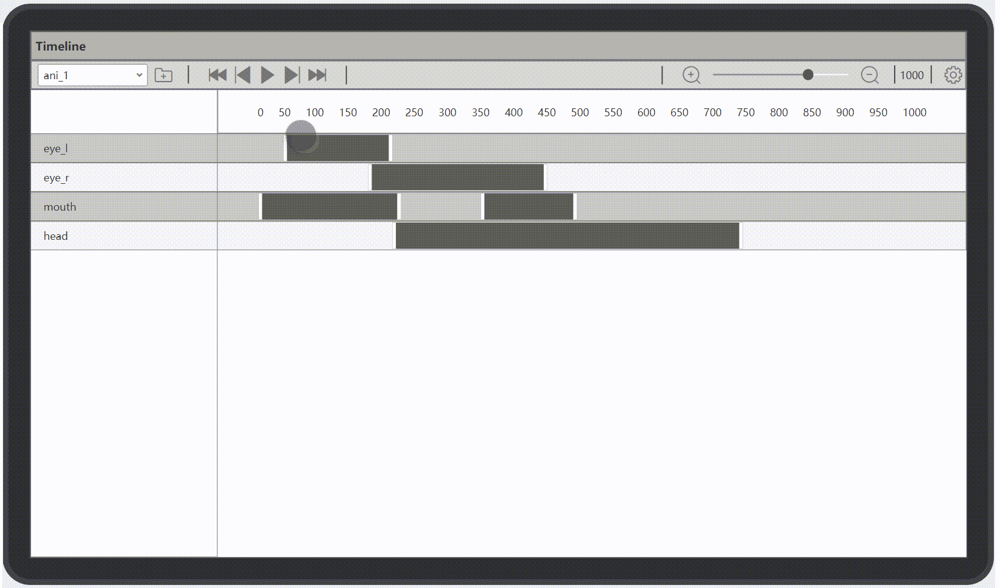
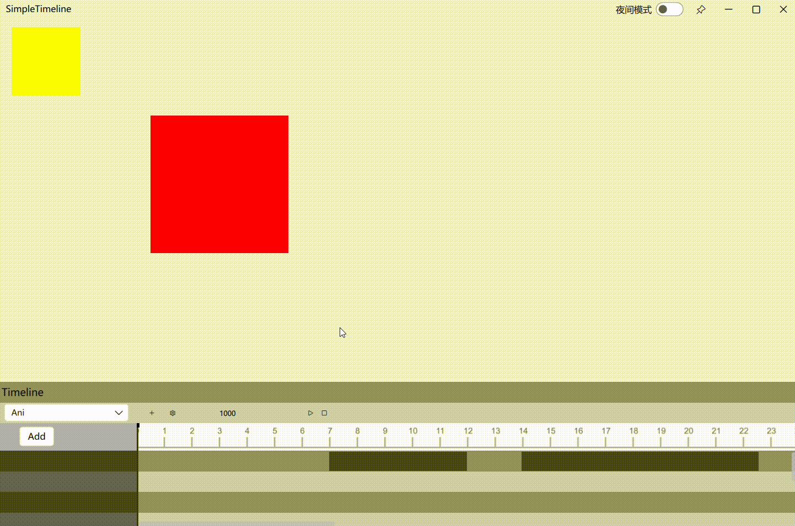

SimpleTimeline是一个基于Qt动画框架实现的关键帧时间线动画编辑器

## 原型设计

原型设计使用摹客完成

## 后端实现

后端基于Qt的并行动画组和串行动画组实现

SimpleTimeline由一个并行动画组和一个串行动画组容器构成

## 前端实现

由于需要结合QtQuick3D，所以前端使用QML实现，后期可以考虑基于Qwidget实现，可以用于widget项目中

主要由基本矩形等元素构成，逻辑方面使用内嵌的Javascript实现

## 编辑动画Demo

## 动画性能测试

由于后端使用C++实现，实际测试发现其性能还是不错的
