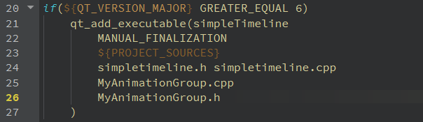
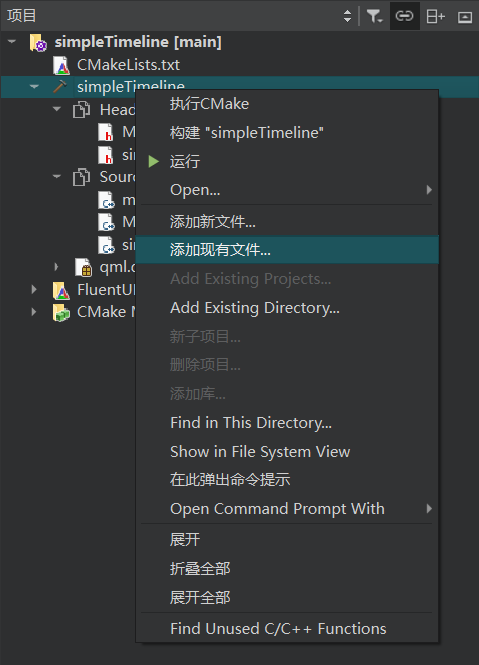
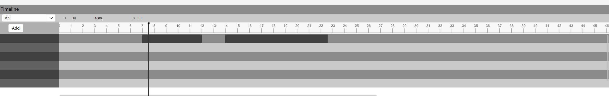
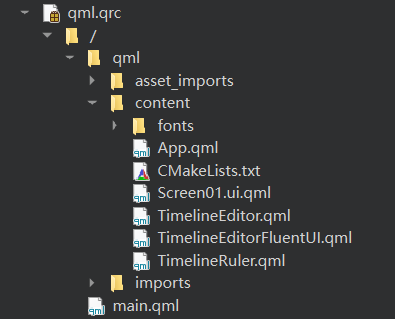
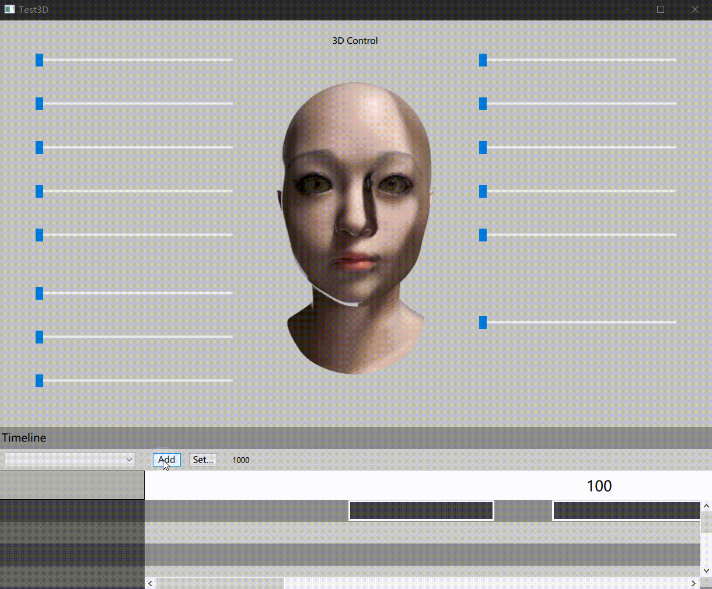

SimpleTimeline是一个完整的，可独立运行的软件模块

其前端使用QML实现，后端使用C++实现，所以如果只需要使用功能，可以只移植C++部分，如果需要直接使用整个项目，则需要同时移植QML部分

## C++部分

主要有以下文件

```
simpletimeline.cpp
simpletimeline.h
MyAnimationGroup.cpp
MyAnimationGroup.h

```

simpletimeline是主要逻辑实现的地方，时间线的创建，动画的增删改查都在这里实现

MyAnimationGroup是一个简单的动画容器，主要方便于动画的管理

首先是一直到项目中，这里以C++项目为例

### 文件添加

1. 将上面提到的文件拷贝到项目目录
2. 在CMakeLists.txt中添加编译

这里是简单的示例



如果不会自己修改CMakeLists.txt文件，则可以使用QtCreator添加现有文件功能，会自己帮你管理项目文件



### 使用案例

可以在C++中使用，也可以在QML中使用

#### C++使用

```c++
#include "widget.h"
#include <QPushButton>
#include <QDebug>

Widget::Widget(QWidget *parent)
    : QWidget(parent)
{
    setGeometry(300, 300, 500, 300);

    button = new QPushButton("Animate");
    button->setParent(this);
    button->setGeometry(10, 10, 180, 80);

    QObject::connect(button, &QPushButton::clicked, [&]() {
        qDebug() << "button clicked";
        qDebug() << timeline;
        timeline->start();
    });

    timeline = new SimpleTimeline();

//    timeline->createAnimate(this, "pos", "posani", 3000);
//    timeline->addFrame("posani", 0, 0, QPoint(300, 300));
//    timeline->addFrame("posani", 0, 0.2, QPoint(600, 300));
//    timeline->addFrame("posani", 0, 0.5, QPoint(600, 600));
//    timeline->addFrame("posani", 0, 0.7, QPoint(300, 600));
//    timeline->addFrame("posani", 0, 1, QPoint(300, 300));

//    timeline->createAnimate(this, "size", "sizeani", 2000);
//    timeline->addFrame("sizeani", 0, 0, QSize(500, 300));
//    timeline->addFrame("sizeani", 0, 0.2, QSize(600, 300));
//    timeline->addFrame("sizeani", 0, 0.5, QSize(600, 600));
//    timeline->addFrame("sizeani", 0, 1, QSize(500, 300));

    timeline->createAnimate(this, "posani");
    timeline->addFrame(this,"posani",QPoint(300,300), 0 , 1000, "pos");
    timeline->addFrame(this,"posani",QPoint(600,300), 1 , 3000, "pos");
    timeline->addFrame(this,"posani",QPoint(300,600), 10 , 5000, "pos");
    timeline->addFrame(this,"posani",QPoint(300,300), 15 , 4000, "pos");
    timeline->deleteFrame("posani",4000);
    timeline->updateFrame("posani", QPoint(600,600), 2, 3000);


}

Widget::~Widget()
{
}
```

创建了一个简单的窗口，窗口中包含一个按钮用于启动动画，创建了一条时间线，然后创建了一个属性动画，控制了窗口的位置不断变化，同时使用了增删改动画的方法


#### QML使用

在QML中使用有很多方法，目前使用qmlRegisterType将类注册之后在QML中使用

```c++
#include "simpletimeline.h"

int main(int argc, char *argv[])
{
	qmlRegisterType<SimpleTimeline>("SimpleTimeline", 1, 0, "STimeline");
}

```

其中SimpleTimeline是类的名字，"SimpleTimeline"是之后import的名字，后面两个数字是主版本和次版本，"STimeline"是使用时候的名字

下面是一个简单的使用demo

```qml
import QtQuick 2.15
import QtQuick.Window 2.15
import SimpleTimeline

Window {
    id: main
    width: 640
    height: 480
    visible: true
    title: qsTr("Hello World")

    MouseArea {
        anchors.fill: parent
        onClicked: {
            stimeline.begin()
            stimeline.doSomething("stimeline")
            stimeline.animationFinished()
            stime2.begin()
            stime2.doSomething("stime2")
            stime2.animationFinished()

            stimeline.start()
        }
    }

    STimeline {
        id: stimeline
        onBegin: console.log("stimeline onBegin")
        onAnimationFinished: console.log("stimeline onAnimationFinished")
    }
    STimeline {
        id: stime2
        onBegin: console.log("stime2 onBegin")
        onAnimationFinished: console.log("stimeline onAnimationFinished")
    }

    Rectangle {
        id: rectangle
        x: 220
        y: 140
        width: 200
        height: 200
        color: "#ff0000"
    }

    Component.onCompleted: {
        console.log("Component.onCompleted")
//        stimeline.createAnimate(rectangle, "x", "xani", 1000)
//        stimeline.addFrame("xani", 0, 0, 220)
//        stimeline.addFrame("xani", 0, 0.2, 100)
//        stimeline.addFrame("xani", 0, 0.5, 0)
//        stimeline.addFrame("xani", 0, 1, 220)
//        stimeline.createAnimate(rectangle, "y", "xani", 1000)
//        stimeline.addFrame("xani", 0, 0, 140)
//        stimeline.addFrame("xani", 0, 0.2, 100)
//        stimeline.addFrame("xani", 0, 0.5, 0)
//        stimeline.addFrame("xani", 0, 1, 140)
        stimeline.createAnimate(rectangle, "xani")
//        stimeline.addFrame(rectangle, "x", "xani", 220,  1,    0)
        stimeline.addFrame(rectangle, "x", "xani", 100,  1,  200)
        stimeline.addFrame(rectangle, "x", "xani",   0,  1,  500)
        stimeline.addFrame(rectangle, "x", "xani", 400,  1,  700)
        stimeline.addFrame(rectangle, "x", "xani", 220,  1, 1000)
        stimeline.updateFrame("xani", 100, 1, 1000)
        stimeline.deleteFrame("xani", 700)
        stimeline.createAnimate(rectangle, "yani")
//        stimeline.addFrame(rectangle, "y", "yani", 140,  1,    0)
        stimeline.addFrame(rectangle, "y", "yani", 100,  1,  200)
        stimeline.addFrame(rectangle, "y", "yani",   0,  1,  500)
        stimeline.addFrame(rectangle, "y", "yani", 300,  1,  700)
        stimeline.addFrame(rectangle, "y", "yani", 140,  1, 1000)
        stimeline.updateFrame("yani", 100, 1, 1000)
        stimeline.deleteFrame("yani", 700)
    }

}


```

首先是import SimpleTimeline，然后创建了两个时间线，分别是stimeline和stime2，然后使用stimeline创建了两个属性动画，分别是x和y，同时使用了增删改动画的方法


## QML部分

QML作为前端，主要实现了一个简单的界面



主要有以下文件

```
TimelineEditor.qml
TimelineEditorFluentUI.qml
TimelineRuler.qml
```

TimelineRuler.qml是时间线上显示时间的实现
TimelineEditor.qml是时间线的实现
TimelineEditorFluentUI.qml是时间线的FluentUI实现

### 文件添加

1. 将上面提到的文件拷贝到项目目录
2. 在CMakeLists.txt中添加或者使用qrc管理

下面是简单的示例


### 使用案例

```qml
// Screen01.ui.qml

property alias timeline: timlineEditor

TimelineEditor {
	id: timlineEditor
	width: parent.width
	height: parent.height - parent.height / 1.4
	anchors {
		bottom: parent.bottom
		bottomMargin: 0
	}
}
```

```qml
// App.qml

Screen01 {
	id: mainScreen
	width: parent.width
	height: parent.height
	timeline {
		onStart: {
			console.log("start")
			stimeline.start()
		}
	}
}

```

上面是一个最简单的示例

在Screen01.ui.qml中使用了TimelineEditor，并通过property alias timeline使其能够在上层使用，一个是因为.ui.qml中不能写js，另一个也是把UI和逻辑分开

然后在App.qml中使用，TimelineEditor中定义了signal start，并在按钮按下的时候触发，通过onStart可以在信号触发的时候执行动作，示例中使用console.log输出了start和启动了时间线stimeline，即启动了动画



TimelineEditorFluentUI.qml是时间线的FluentUI实现，将在稍后FluentUI的使用说明后一起说明
